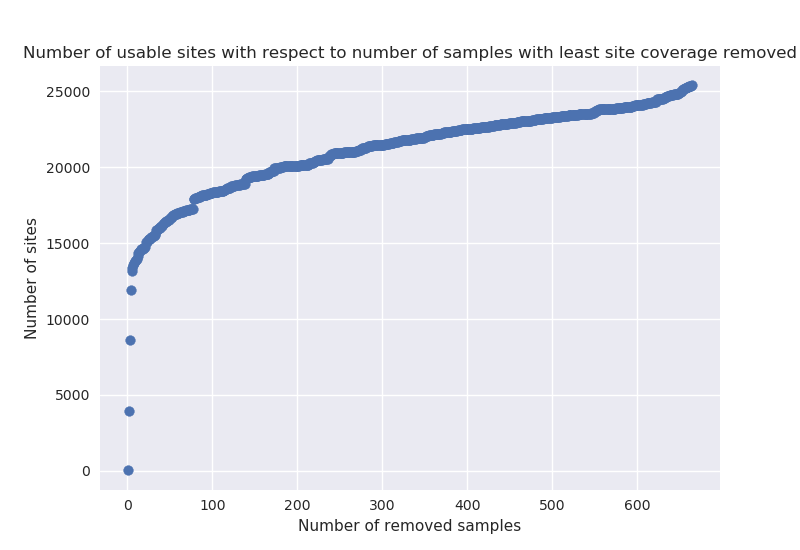
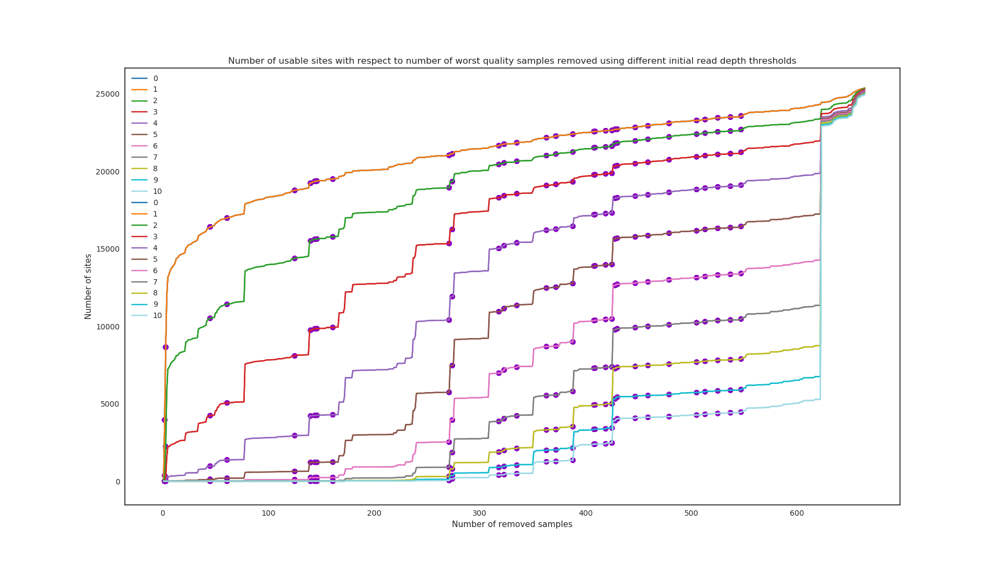

?image=pic/pipeline.png&size=auto 80%
---
#### Atlases kritēriji
 * Paraugu atlase
 * Reģionu filtrs
 * Pārklājuma un procentu filtrs (Cik % paraugu jābūt pārklājumam X)

---
#### Paraugu atlase

---
#### Paraugu atlase

---
#### Paraugu ietekme uz koku (UPGMA)

---
#### Variantu filtri
* Reģionu filtrs
 * TGSTB (28374 -> 22240)
* Pārklājuma dziļuma un procentu filtra novērtējums uz koku
 * (Cik % paraugu jābūt pārklājumam X)
---
#### Pārklājuma un procentu filtra novērtējums
* Pārklājuma dziļums 1,2,3..10
* Procentu filtrs 50,55,60..100%
* Izmantojot dažādas parametru kombinācijas atlasa variantus
 * Kopā 110 parametru kombinācijas 
 * (1,50%), (1,55%), ... , (10,100%)
* Katrai kombinācijai konstruē filoģenētisko koku (*Maximum likelihood*)
* Aprēķina starp kokiem *Robinson-Foulds* distances
---?image=pic/snp_nr.png&size=auto 70%
---?image=pic/cov_dists.png&size=auto 90%
---?image=pic/frac_dists.png&size=auto 90%
---?image=pic/evaluation.png&size=auto 80%
---?image=pic/aln.png&size=auto 100%

---?image=pic/missing_data_impact.png&size=auto 70%

