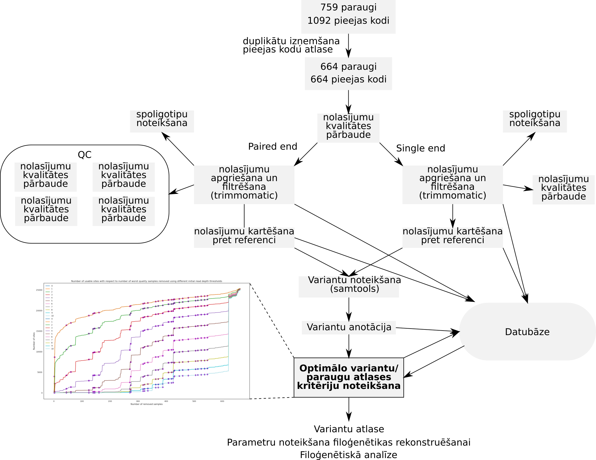

#### Filoģenētisko koku rekonstruēšanas algoritmi
* Parsimonijas metodes
* Distanču metodes
 * *UPGMA*
 * *Neighbour joining*
* *Likelihood* metodes
 * *Maximum likelihood*
* *Bayesian* metodes
---

