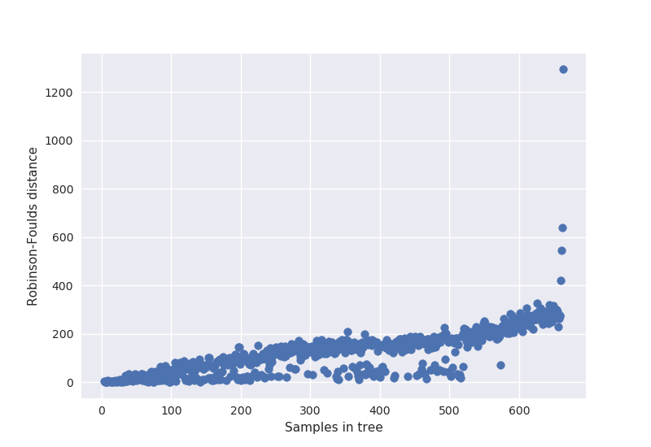

#### Filoģenētisko koku rekonstruēšanas algoritmi
* Parsimonijas metodes
* Distanču metodes
 * *UPGMA*
 * *Neighbour joining*
* *Likelihood* metodes
 * *Maximum likelihood*
* *Bayesian* metodes
---
#### Atskats uz padarīto
---?image=pic/pipeline.png&size=auto 80%
---
#### Atlases kritēriju pārskats
 * Paraugu atlase
 * Paraugu ietekme uz koku (UPGMA/ML)
 * Reģionu filtrs
 * Pārklājuma un procentiles filtrs (Cik % paraugu jābūt pārklājumam X)

---
#### Paraugu atlase
---
#### Paraugu ietekme uz koku

---
#### Jaunās lietas
* Trūkstošo datu ietekme uz filoģenētiku
* Minimālais SNP skaits
* Klasteru tīrīšana
---
#### Variantu filtri
* Reģionu filtrs
 * TGSTB
* Pārklājuma dziļuma un procentu filtra novērtējums uz koku
 * (Cik % paraugu jābūt pārklājumam X)
---
#### Pārklājuma un procentu filtra novērtējums
* Pārklājuma dziļums 1,2,3..10
* Procentu filtrs 50,55,60..100%
* Izmantojot dažādas parametru kombinācijas atlasa variantus
 * Kopā 110 parametru kombinācijas 
 * (1,50%), (1,55%), ... , (10,100%)
* Katrai kombinācijai konstruē filoģenētisko koku (*Maximum likelihood*)
* Aprēķina starp kokiem *Robinsons-Foulds* distanci
---?image=pic/snp_nr.png&size=auto 70%
---?image=pic/cov_dists.png&size=auto 90%
---?image=pic/frac_dists.png&size=auto 90%
---?image=pic/evaluation.png&size=auto 70%
