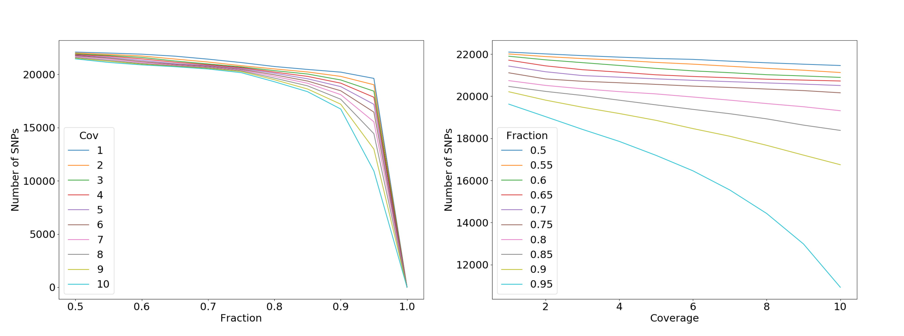

#### Filoģenētisko koku rekonstruēšanas algoritmi
* Parsimonijas metodes
* Distanču metodes
 * *UPGMA*
 * *Neighbour joining*
* *Likelihood* metodes
 * *Maximum likelihood*
* *Bayesian* metodes
---
#### Atskats uz padarīto
---?image=pic/pipeline.png&size=auto 80%
---
#### Atlases kritēriju pārskats
 * Izlēcošo paraugu identifikācija
 * Paraugu ietekme uz koku (UPGMA/ML)
 * Reģionu filtrs
 * Pārklājuma un procentiles filtrs (Cik % paraugu jābūt pārklājumam X)

---
#### Paraugu atlase
---
#### Paraugu ietekme uz koku
---
#### Jaunās lietas
---
#### Trūkstošo datu ietekme uz filoģenētiku
---
#### Minimālais SNP skaits
---
#### Klasteru tīrīšana
---
#### Variantu filtri
* Reģionu filtrs
 * TGSTB
* Pārklājuma dziļuma un procentiles novērtējums uz koku (Cik % paraugu jābūt pārklājumam X)
---
#### Rezultāts
<!---->
---?image=pic/snp_nr.png&size=auto 80%

